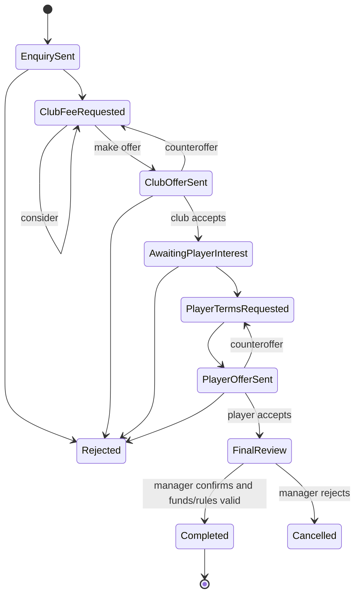

# USM 98–99 fidelity audit and rebuild plan

> Baseline audit retained for traceability. See [build 0.3 implementation status](IMPLEMENTATION-STATUS.md) and [topic-by-topic progress](audit/implementation-progress.json) for subsequent work. The original partial/missing counts below are not current completion counts.

19 September 2026. Scope: audit and planning, not an assertion that the missing systems have now been implemented.

## Decision

Keep the native application, recovered historical squads/audio, save support and useful live-match work. Replace the generic management screens and their simplified domain models with the original game's room structure, decision flows and information density. A colour change alone cannot fix the underlying omissions.

The current edition has **42 partially represented topics and 20 missing topics across all 62 non-empty original CD help sections**. None is being certified as completely faithful by this audit. This is a topic inventory, not a percentage-complete estimate: a negotiation engine is much more work than a save panel.

The full traceable [screen matrix](audit/SCREEN-MATRIX.md) maps each topic to the inspected code and required changes. The desired presentation is the original **red/chrome title and action framing, blue navigation and secondary buttons, yellow labels, white values, and blue/purple or dark teal data panels**. Remove lime green as the application accent. Green remains appropriate for grass and original position/stat colour coding. The user's references themselves show both purple and teal data surfaces, so fidelity does not mean replacing every colour with red.

The current application and career save were not changed during this audit.

## Evidence and confidence

Evidence precedence:

1. The supplied original CD's version-specific README and data.
2. Its English help topics, corroborated by static executable strings.
3. The original Sierra manual and the user's screenshots for layout and visual behaviour.
4. Current source code to establish what actually exists.
5. Explicit hypotheses where formats or algorithms remain unresolved.

`OriginalCD/Readme.txt` identifies **version 2.00, 15 October 1998**. It adds final acceptance/rejection after a transfer agreement, 1.5× match speed, and player links in Sierratext. These override incomplete descriptions in older help/manual material. The help still refers to six leagues in places; the supplied CD importer finds seven countries. Do not use stale help wording to remove CD content.

The two Player Search reference images show modern players, so they are useful UI references, **not** historical roster evidence. Their repeated image is counted once. Other references demonstrate the layout of Team Talk, Merchandise, Transfers, Chairman and Team Data.

Sources audited:

| Evidence | Findings | Confidence / limit |
|---|---|---|
| English CD `help.txt`, 78,135 bytes | 62 non-empty numbered topics; complete extracted topic text retained | Documented behaviour; not an executable trace |
| CD README | Final transfer veto, 1.5× speed, Sierratext player access | Version-specific documented changes |
| 671 files in extracted English executable directory | Hashed inventory including data, panels, room imagery, fonts, audio and binaries | Inventory scope is this directory, not every language/audio track on the entire CD |
| `COACH.DAT`, 5,070 bytes | 195 aligned 26-byte candidate records with readable names | Names/stride supported; enum meanings, wage units and contract representation not yet proven |
| `ADVERT.DAT`, 15,000 bytes | 100 candidate 150-byte records with advertiser names, including repeats | Not 100 unique companies; category/price fields undecoded |
| `GAME.TXT`, 145,738 bytes | Binary offset table, not plain text: 1,525 monotonic offsets including final sentinel; 1,524 message records | Template/control-token semantics remain undecoded |
| `Usm98-99.exe`, static strings | Named original menus, training activities, staffing fields, private-phone controls, banking, stand information | Strings establish vocabulary/existence, not transition logic or probabilities |
| 32 `.PNL`, 65 `.PIC`, 39 `.SPR`, 29 `.BIT` files | Includes panel skins, room assets, toolbar/fonts, advertising and stadium pieces | PAK2 assets not decoded in this audit; filenames alone do not prove a visual mapping |
| `.FOR`, `.MOV`, `.SET`, `FORM.DAT`, `STADIUMS.MAP` | Original formation/tactic/layout data exists | Structures still need validation; `.MOV` here must not be assumed to mean QuickTime video |
| `Sources/USMCore` and `Sources/USMApp` | Current models, mutation paths, screens and aliases inspected | Source audit, not a new exhaustive runtime playtest |

Reproduce the local inventory with `python3 tools/audit_original.py`. Outputs in `docs/audit` include source hashes, all help sections, executable string offsets, indexed messages, and candidate staff/advertiser records. This script reads the supplied files and writes only audit outputs. No Windows executable was run.

Online corroboration: the [preserved original Sierra manual](https://oldgamesdownload.com/manual/ultimate-soccer-manager-98-99-windows-manual-english/) supports the room-based structure. Its introductory note explicitly treats corrupt approaches as fictional/random, rather than real traits of named people or clubs. Detailed requirements below are primarily derived from the local CD help and README, not modern guides or later USM databases.

## What is wrong with the current implementation

- `ContentView.clubShell` wraps nearly all data screens in an outer `ScrollView`. This makes complete forms scroll as if they were web pages. Layout defects also previously put controls below the viewport.
- `BusinessView` is reused for accounts, ticketing, merchandise and catering. A destination label changes, but the actual system does not. Advertising has no model; the three sponsor buttons are invented fixed tiers.
- `CoachingView` sells a generic development level for `(level + 1) × £180,000`, up to five levels. There are no named employees, specialties, employment contracts or individual salaries. This needs replacement, not a cheaper button.
- `TrainingView` has one focus/intensity and a decorative weekly illustration. It does not schedule training sessions. `IndividualTrainingView` assigns a focus rather than an actual coach to a player/skill.
- `TransfersView` searches by name and broad position, caps results at 100, and labels that list a scouting shortlist despite having no persistent shortlist or scouts. Offers are a fee/wage threshold settled after a week. The original interactive negotiation process is absent.
- Room targets are wrong or combined: green formation board goes to competitions; opposition television is missing; the manager's phone goes to transfers; current negotiations and scouting share one search page. Generated art also lacks some required objects.
- `GroundBuilding` has a generic level/capacity but not the original terrace/seating, roof, boxes, corner eligibility, upkeep or condition. A stand can be selected, but the full original stand inspection/improvement flow does not exist. Fixed +5,000-seat projects are a substitute.
- The visual language remains mixed: modern dark cards and lime accents, native pickers/steppers, small room thumbnails inside large blank navigation areas, and some isolated red styling. The result is not a coherent USM interface.
- Foundational fields are still inferred or generated: preferred player roles, ages, nationalities, wages, club capacity, values and many economic rules. New historical names alone do not make the simulation historically faithful.
- Match presentation and live control have improved, but fouls, offside, disciplinary rules, dead-ball substitutions, full individual instructions and custom set pieces are not implemented. Non-managed games use a different simplified statistical model.

## Original navigation and screen contract

Restore the compact icon ribbon: **FILE · STAD · BUSI · CHAIR · DATA · TRANS · MNGR · SQUAD · MATCH · HELP**, with a visible calendar. Use readable expanded tooltips and keyboard access. The original names can fit at normal desktop scale; avoid adding a second dashboard navigation hierarchy.

Each destination needs a distinct screen, a correct model and a tested return path. No placeholder destinations that silently open an unrelated page.

| Room | Original destinations to restore |
|---|---|
| File/car park | Context help, configuration, named save/load browser, restart, exit, player control/resignation where applicable |
| Stadium | Dynamic estate; click each stand for close-up improvement; building catalogue/placement; direct office and shop/catering links |
| Business | Advertising, tickets, sponsorship, catering, merchandise, accounts and finance |
| Chairman | Match/season objectives, evaluation, evaluation graphs, competition trophies |
| Data | Player, club, manager and historical files; other teams; league/competition information |
| Transfers | Binoculars → Player Search; folder → Current Negotiations; shortlist → comparison/scouting; bin → selling; trays → loans |
| Manager | Filing cabinet, internal voicemail, external email, newspaper, Sierratext, video archive, printer, fixtures, private mobile, scrapbook |
| Squad | Shirts → selection; blackboard → Team Talk; TV → opposition; balls → team timetable; cones → individual training; newspaper → named staff; medical box → injuries; green board → formation editor; folders → advanced tactics |
| Match | Illustrated tunnel: Watch, Instant, Cancel; match controls and post-match report |

Notable correction: the CD's **private mobile phone** offers Rig Match, Offer Bung, Place Bet and News on Bets. A bung helps a transfer approach; it is not documented as asking a team to field a weaker XI. Match rigging increases the chance of a desired outcome without guaranteeing it. Keep those distinct rather than implementing the user's remembered descriptions as though they were confirmed mechanics.

## Required system rebuilds

### Player search, shortlist and scouting

One fixed screen: filter strip at top, player table in the centre, permanent action bar below. Filters combine; only the result table scrolls/pages.

Restore sort criteria, role, league, division conditional on league, contract/listed/short-contract status, first-team/reserve status, age range, value range and individual lower/upper skill bounds. Scout Suggests narrows suitable players relative to the managed club. Skills/Details toggles columns; Reset clears filters. Match the original period-based reset behaviour while retaining selection inside the same period.

Actions: Approach/Buy, Loan, View, Shortlist. Double-click opens a record. Transfer List is an explicit contract-status view of the same search engine, not another incomplete search. Remove the arbitrary 100-player truncation: count all matches and page/virtualise rows.

Shortlist has a persistent upper list and comparison against the current squad below. Sort/skill bars work on both. Scouts are employed people, assigned and unassigned to targets, producing reports after time. Show current assignment, elapsed observation, report and recommendation. Quality affects uncertainty; youth assessment concerns future usefulness while older-player reports concern current suitability. Competing bids generate a notice.

Dependencies: verified birth dates/age/nationality/preferred position; contract and listing states for all players; time/calendar; staff; report histories. Show unknown fields honestly until decoded rather than inventing historical facts to make filters appear functional.

### Transfers and contracts

Replace `Offer` with a persisted negotiation state machine. A proposal and a reply are different records; every screen can show the exact terms and status at the time of that message.

Also support Drop, expiry/deadline cancellation and funds failure in appropriate open states. Delays vary by stage. Exact response timing, negotiation patience and valuations are unverified original formulas and must be calibrated rather than claimed as extracted.

Club terms: initial fee, extra fee after an appearance threshold, offered players in exchange. Player terms: weekly wages, signing fee, contract length, league-title bonus, cup-win bonus, promotion/European-qualification bonus, cup-final bonus, per-win bonus and per-goal bonus. Display the current demand, latest proposal and financial exposure together. Consider leaves the deal open; Reject/Drop ends it; Make Offer edits terms; View opens the player.

Current Negotiations is a dedicated incoming/outgoing list with status, Reply and Drop. Responses open a fax-style panel. Restore the README's final deal veto before cash or registration changes. Completion must be atomic; duplicate replies or reloading cannot pay twice. Stage swaps, future appearance liabilities and bonuses explicitly in the ledger.

Sales reverse the process: asking prices, listing/unlisting, unsolicited approaches, Not For Sale, reject/consider/counter, club acceptance followed by player acceptance. Fast Sell is a distinct discounted immediate action. Loans have listing, requests, agreed weeks, wage responsibility, experience/morale and return processing; do not invent unverified modern clauses as original features.

### Staff and training

Replace the generic coach level with named **available** and **employed** staff. Display name, coach/scout role, specialty, quality, requested/current wage, contract expiry and morale; Hire opens terms, existing staff allow renewal/wage changes/fire with payoff. The help specifies up to six coaches, quality levels and specialist training areas; it does not establish the scout cap. Executable strings confirm Rating, Speciality, Wages, Contract Expires and Existing/Available Staff.

`COACH.DAT` provides a practical next decoding target. Candidate record layout: 10-byte name; +10 values 1–7; +11 values 40–55; +12 little-endian 32-bit values 143–847; +19 values 0–2 in groups of 65. These plausibly represent specialty, age, wage and quality, but are **not yet verified mappings**. Preserve raw records and prove each field against independent evidence before importing it into gameplay. Do not rename +12 to salary solely because the numbers look plausible. Do not retain the invented £180,000 hiring fee.

Team Training is a full fixed timetable with day/time cells and an activity palette. Executable strings include Individual Skills, Attacking, Long Ball, Solo Runs, Ball Skills, Fitness/Physical, Free Time, Defined Tactic, Defending, Offside and 5 A-Side; catalogue completeness and exact slot granularity need further verification. Click activity, then a cell; match periods are locked. Individual and Free Time are meaningful session types. Assistant proposes a balanced plan that can be accepted or edited.

Training Camp opens a compact panel: duration/options, first team/reserves/all, leisure/intensive/timetable and itemised cost, then Arrange. Exact original ancillary options need evidence before being labelled faithful.

Individual Training shows coaches beside the player/skill matrix. Select coach, then skill cell; colour links the assignment. Clicking again clears it. Include workload, per-player intensity, notes, injury state and assistant proposals. Specialist/quality effects, up-to-ten-player workload, boredom, age development and recovery phases affect outcomes. Staff wage costs must enter weekly accounting and contract payouts.

### Business and finance

Advertising and sponsorship are separate decisions with separate contracts.

- **Advertising:** stadium boards versus magazine/programme pages; finite slots; current advertisers and new offers; league-season contracts versus individual home-cup matches; assistant delegation. Accepted board brands appear in match and ground presentation. Price/category and logo indices should be recovered from advertiser records/sprites before assigning semantics.
- **Sponsorship:** received offers, value/term, current sponsor and expiry, accept/reject, waiting for future offers, club-reputation and cup/TV effects. No unlimited instantaneous switching among fabricated tiers.
- **Tickets:** stand-type rows, league/friendly, cup and season-ticket prices; school tickets; capacity eligibility; attendance/revenue history with whole-ground or stand-type selection.
- **Merchandise:** product shelf, outlet selector, costs, editable prices, quantity sold, income and profit; selected-item graphs; assortment changes by outlet; all-outlet aggregation. Item price applies across outlets. Recover programmes, badges, pens, flags, hats and the rest of the catalogue from source evidence.
- **Catering:** separate product catalogue and outlet types, food/drink pricing, costs, sales and profit histories. The current generic business alias must disappear.
- **Accounts:** weekly/yearly views, operating profit separate from transfers and interest, explicit staff/maintenance/contract liabilities, print/export.
- **Finance:** assessed loans and repayment, overdrafts, deposits (executable strings), restricted stadium grants, flotation/shareholder costs. Calibrate rates and constraints; do not substitute arbitrary borrowing buttons.

### Stadium and buildings

Keep a dynamic model, but make the estate dense and legible like the reference: paved commercial areas, varied facades, recognisable stand sections, entrances, roads, service buildings, flags, lighting and people. Use an original-like default isometric camera; orbit can remain optional. The title illustration cannot masquerade as a live stadium thumbnail after construction changes—render the actual estate into that thumbnail.

Click a stand to open a **stand inspection screen** with a large isolated preview, stand name, previous/next arrows, current versus proposed capacity, terrace/seating, cover, executive boxes, cost, duration and maintenance/condition. Buttons preview the changed geometry before committing. Show a summary of all requested works. Add corner sections only when adjacent stands satisfy verified conditions. Source restrictions: no shrinking a stand, reverting seats to terraces, or removing a cover through the upgrade flow; no executive boxes on corners.

Construction must affect usable match capacity; the current upgrade simply leaves the existing facility open unchanged. Exact closure rules need validation. Condition and maintenance can lead to deterioration and original-style consequences. Current demolition freedom must not bypass verified stand restrictions accidentally; reconcile modern optional relocation with original constraints explicitly.

Separate building catalogue from stand improvements. Evidence names Programme Stand, Stall, Small/Medium/Large Shop, Burger Bar, Restaurant and Car Park; catalogue limits/prices/footprints and other types must be decoded. Preview multiple placements on valid land, left-click to place, right-click to review/confirm or cancel, with collision and funds checks. Original protected offices cannot be demolished. State and economics must drive visible geometry.

### Chairman, private phone and career world

Chairman: match and season objectives, explanatory evaluations, four ratings (chairman, financial, fans, players/staff), toggleable history graphs and competition trophies. Poor performance and misuse of restricted money require actual career consequences, not just a number decreasing. Restore manager contract renewal, dismissal, resignation and end-season job applications.

Private-phone fictional game systems: rig offers against the upcoming opponent; transfer bungs to a selected club/manager; in-game bets and bookmaker replies. Model submitted/pending/accepted/refused/exposed/resolved states, costs, uncertain effects, news and career consequences. Use only simulated currency and fictional random responses, with no real-world transactions. Exact probabilities, bet menus/odds and exposure triggers are research items, not decoded facts. A refused or accepted attempt must not reveal the final match result. Resolve rig effects inside the live simulation rather than forcing a final score.

Restore typed communications, unread badges, news articles, scrapbook and saved mail. The message bank can supply original tone once token substitution is decoded. Expand player/club/manager/history files, competition tables, records, trophies, national squads, awards and Sierratext. Implement the actual calendar, cups, European schedules, transfer deadlines, season reporting and competition-specific bench/substitution rules. Manager/Coach mode and 1–8 local managers are original features, not optional omissions from a claim of full parity.

### Tactics and match depth

Restore Team Talk with captain/set-piece takers, bonus and instructions beside the pitch; custom formation choice, moves and set pieces. Formation Editor supports draggable slots, protected stock formations, save-as and undo. Advanced Tactics uses 34 attack/defend situations, trails, copy/paste and multi-step move/pass/dribble/wait/shoot routines. Instructions must execute in the simulation under the documented conditions, not just persist in the UI.

Match options: normal angled view and overhead, names/numbers/both, managed/both teams, commentary toggle, 1×/1.5×/2×/4×/8×/16×. Queue substitutions for a legal stoppage. Add fouls, cards, offside, injuries, performance ratings, detailed half/full-time panels and individual player clicks/instructions. Replay stores actual historical simulation frames/events and cannot alter the live branch or reroll outcomes. Keep original music/effects; original spoken commentary requires event-index decoding and speed rules.

## Reskin and fixed-screen specification

This is a native game renderer/control set, not a web theme. SwiftUI/AppKit can remain underneath; platform-default controls should not determine the visual language.

**Proposed design tokens** (matched by eye to references, not claimed extracted palette entries): ruby title gradient `#210000 → #C71912 → #590400`, cobalt buttons `#11164E → #354DCD`, yellow labels `#FFE34A`, warm white values `#F3F0E5`, chrome edges `#D5D6D8/#535866`, indigo panel `#292754` and alternate teal `#1D4D48`. Recover palette/font data to refine them. Use original-like condensed bold headings, compact tabular numerals and clearly bevelled pressed/disabled states. Avoid default rounded Mac buttons, popup menus, segmented controls and modern dashboard cards inside the game.

Build shared `GameButton`, `ArrowValueControl`, `GameChoicePanel`, `GameTabStrip`, `GameTable`, `GameTitleBar`, `GameDialog`, `RoomRibbon` and `GameScreen` components. Provide keyboard focus, VoiceOver labels and visible disabled states behind the custom skin. Native file/print panels may remain for external import/export/printing, not ordinary gameplay.

**Layout contract:** a 1280×720 reference canvas with responsive integer row heights, tested at 1100×720, 1280×720, 1440×900 and larger Retina windows. Header and footer are fixed and always visible. Content has a bounded central viewport. Only a player/staff/offer/message list scrolls or pages; never the whole screen. Use explicit tabs or a compact child panel for secondary data. No modifier may apply a minimum screen height independently to every child. Modal height is bounded by the host content area; no controls below the display or Dock.

| Screen | Fixed composition |
|---|---|
| Player Search | Red title/cash; two compact filter rows; fixed-header table; bottom Buy/Loan/View/Shortlist/Skills/Exit. Skill ranges in a bounded panel. |
| Negotiation fax | Header with stage and sender; latest demand and current proposal side by side; finance summary; View/Reject/Consider/Make Offer. Final review has explicit Accept/Reject. |
| Team Training | Left activity palette, centre day/time grid, right selected-session/help panel; bottom Individual/Assistant/Camp/Exit. |
| Staff market | Employed and available tables, selected-person details/terms, bottom Hire/Renew/Fire/Exit. |
| Individual Training | Coach selector and workload; player/skill matrix with assigned colours; fixed intensity/notes area and action bar. |
| Stand inspection | Large geometry preview, current/proposed controls, adjacent-section arrows; always-visible cost/duration/available cash and Improve/Cancel. |
| Merchandise/Catering | Product/outlet artwork upper-left, charts upper-right, item table below, fixed outlet tabs/action footer. |
| Advertising | Boards/Magazine toggle; current slots and offers; visible term/income; Accept/Assistant/Exit. |
| Team Talk | Pitch/selection left, compact instruction stack centre, formation/move/set-piece selectors right; fixed bottom actions. |
| Team Data | Structured club/season/history panels with direct Players/Other Teams/Exit; paged records rather than a long dashboard. |

Retain the generated rooms the user likes, but revise them only after the hotspot inventory is frozen. Missing TV, folders, mobile, binoculars, fax and loan trays must be present and spatially distinct. The generated mahogany boardroom and scouting office do not currently match the exact chairman/transfer room compositions in the new references; adapt their composition before calling the art faithful. Reuse decoded original skins/icons where viable, or rebuild high-resolution equivalents with the same hierarchy. Every room thumbnail must correspond to the actual room entered.

## Implementation sequence and completion gates

Each milestone is a playable vertical slice. A menu is not “done” until its choices affect state, time, finances/simulation, save/load and feedback. Keep an explicit parity checklist; never replace an unknown mechanic with an unlabelled shortcut.

| Phase | Deliverable and code changes | Dependencies | Acceptance gate |
|---|---|---|---|
| 0 — Evidence/data | Decode staff/advertising, remaining player fields and original palette/panels; source record fixtures and confidence map | Audit outputs | Verified fields have offsets/examples; unknowns stay labelled; no source changes |
| 1 — Screen foundation | New game controls, red/chrome/blue theme, all original navigation destinations, bounded screen layout and context help; remove outer page scrolling | Reference UI inventory | Every form and footer fits all target sizes; only lists scroll; distinct routes; no generic placeholders disguised as complete systems |
| 2 — Staff/training | Named market, wage/term handling, individual coach assignments, editable timetable and camps | Verified staff, calendar baseline, versioned saves | Hire known candidate, pay correct weekly wage, assign skill, schedule sessions, observe development/recovery, renew/fire and reload accurately |
| 3 — Transfers/scouting | Full filters, persistent shortlist, reports, staged club/player faxes, sale/loans, final review | Player fields, calendar, staff | Find a constrained candidate; scout; receive/counter terms; reject or final-confirm; funds and ownership move once; loans return; reload at every state |
| 4 — Business | Separate ad/sponsor contracts, tickets, product/outlet data, accounts and banking | Advertiser data, calendar, contract ledger | Accept board/sponsor; see brands and expiry; sell items with correct costs/margins; tariffs affect attendance; all totals reconcile |
| 5 — Stadium | Stand detail editor, types/cover/boxes/corners, construction closure, upkeep/condition; full catalogue and placement | Capacity/economy data and finance | Preview/commit specific stand works; availability changes; complete geometry matches choices; maintenance and saved layouts behave correctly |
| 6 — Tactics/match | Team Talk completeness, formations, advanced moves, offside/fouls/cards, stoppage subs, replay, match options | Rules/calendar and tactical data | Each instruction visibly affects play; deterministic recorded replay; legal restart/substitution rules; speed parity incl. 1.5× |
| 7 — Career parity | Chairman/jobs, private-phone fiction, communications, Sierratext, records, cups/Europe, Coach mode and local multiplayer | Shared calendar/rules/finance complete | Full season across modes, contracts/deadlines/loans/projects through rollover, consequences and records; no lost queued actions |
| 8 — Fidelity calibration | Original asset polish, match/economy balancing, accessibility and performance | All slices integrated | Representative original scenarios compared with evidence; longer careers remain coherent; complete gap matrix revisited and remaining deviations declared |

Calendar and competition definitions begin as a dependency before phases 2–4 and are completed in phase 7; they cannot be bolted on after “weekly” negotiations and training have been hard-coded. Unknown binary decoding may change phase estimates, so no unsupported time estimate or total parity percentage is given.

## Native architecture and migration

Keep pure Swift rules separate from the view layer. Introduce typed routes rather than string destinations and a typed command boundary rather than UI buttons mutating cash directly. Proposed modules/models:

- `CareerCalendar`, `CompetitionRules`, `ScheduledAction` and explicit game-period advancement.
- `StaffMember`, `StaffContract`, `TrainingSession`, `CoachAssignment`, `TrainingCamp`, `ScoutAssignment`, `ScoutReport`.
- `Negotiation`, `NegotiationMessage`, `TransferProposal`, `PlayerTerms`, `LoanAgreement`, `ListingStatus`, `ShortlistEntry` and financial liabilities.
- `SponsorContract`, `AdvertisingContract`, `AdvertisingSlot`, `Product`, `Outlet`, `PriceBook`, `SaleRecord`, `LoanAccount`, `Grant`, `ShareholdingStatus`.
- `StandSection`, `StandSpec`, `GroundCondition`, `BuildingType`, `ConstructionProposal` and `ConstructionProject`.
- `Formation`, `SituationPositions`, `TacticalRoutine`, `PlayerInstruction`, `MatchRecording`, discipline and referee state.
- `Objective`, `EvaluationSnapshot`, `CareerRecord`, `Communication`, `PrivatePhoneOffer` and fictional wager state.

Use explicit save versions and migrations. Preserve the user's native career and source folders. Back up before upgrading a save; never silently replace an old squad with CD data or invent employee histories. Legacy generic coaching levels need a declared migration decision (for example a credit and staff-selection prompt), not fabricated named hires. Existing sponsor tiers and flat merchandise prices likewise require a transparent legacy conversion. Final policy should be reviewed in the milestone that introduces each replacement model.

## Verification standard

The existing 19 checks demonstrate internal behaviours, not original fidelity. Keep them, but add evidence-based acceptance scenarios:

1. Screen bounds and input checks at multiple resolutions; footer always visible; long names/translations; keyboard-only routes; pointer checks across every room hotspot and gaps between them.
2. Typed destination coverage: each original menu item opens its own promised function; Exit and Return have the original distinction.
3. Negotiation scenario suite: rejection, counter, consideration, player refusal, deadline expiry, insufficient cash, swaps/appearance clauses, final veto, duplicate-event protection and save/reload at every stage.
4. Staff and training: specialty/quality/workload effects, no overbooked match periods, correct wage/payout ledger, injuries and camp outcomes.
5. Advertising/sponsor/product ledgers, contract expiry, finite slots and visible accepted advertising; no double payment.
6. Per-stand legality, preview versus commit, budget checks, construction capacity, corner dependencies, condition and season carryover.
7. Live tactics/restarters/discipline, deterministic replay and speed independence; match results react to instructions rather than scripted scores.
8. Full multi-competition seasons, jobs, modes, and queued obligations across save/season boundaries.

Open research items must remain visible: exact wages/values/capacities, staff enum mappings and scout caps, advertising categories/prices, slot timetable resolution, camp options, player-age encoding, country-specific competition rules, original negotiation/calibration formulas, rig/bung/betting probabilities, panel/sprite compression and commentary indexing. Static strings and plausible numbers are not proof of those formulas.

The next implementation target is phases 0–1 followed by the staff/training slice. That produces a coherent original-style screen framework and replaces one of the clearest placeholder systems before expanding the rest.
